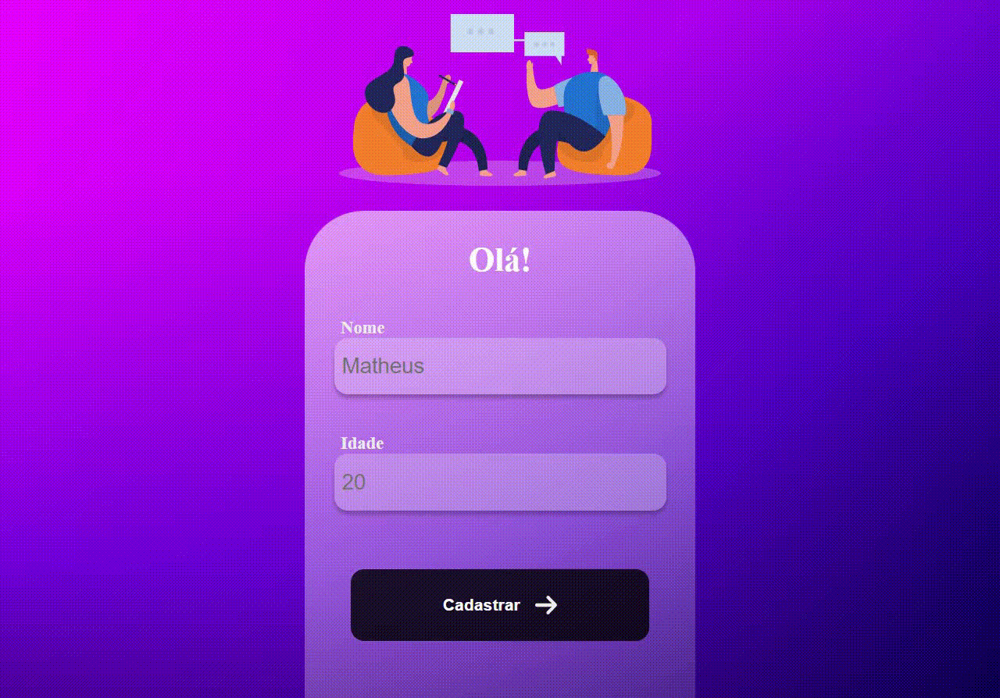

# MOBILE REGISTER

>  O projeto é um site mobile que registra o nome e a idade de algum usuário através do Front-End conectado ao Back-End.
## :page_facing_up: Explicação

Um sistema de registro que tem a opção de cadastrar novos usuários, mostrar todos usuários registrados e deletar um usuário em específico. 

Foi utilizado ReactJs no Front-End e NodeJs no Back-End. Na estilização utilizei Styled Components.

## :rocket: Tecnologias ##

No projeto foram utilizadas as seguintes tecnologias:

- [ReactJs](https://pt-br.reactjs.org/)
- [React Router](https://v5.reactrouter.com/web/guides/quick-start)
- [Styled-Components](https://styled-components.com/docs)
- [NodeJs](https://nodejs.org/en/)

## 🤝 Colaboradores

Agradecemos às seguintes pessoas que contribuíram para este projeto:

<table>
  <tr>
    <td align="center">
      <a href="#">
         
        
          <b>Matheus Santos</b>
        
      </a>
    </td>
  </tr>
</table>

## 📝 Licença

Este projeto está sob licença. Consulte o arquivo [LICENSE](LICENSE.md) para obter mais detalhes.

Made with ♥ by Matheus Santos 👋 Get in touch!

<a href="#top">Volte para o topo</a>
